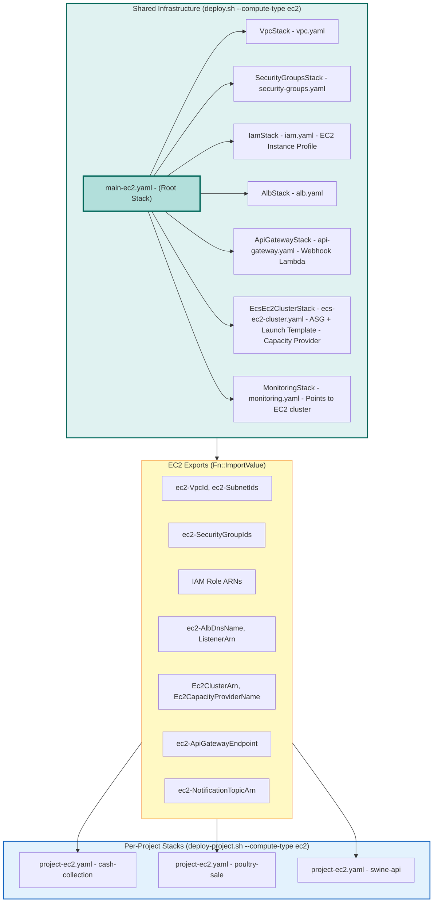

# EC2 — Deployment Model (Two-Tier Architecture)

```mermaid
flowchart TB
    subgraph SharedInfra["Shared Infrastructure (deploy.sh --compute-type ec2)"]
        Main["main-ec2.yaml - (Root Stack)"]
        Main --> VPC["VpcStack - vpc.yaml"]
        Main --> SG["SecurityGroupsStack - security-groups.yaml"]
        Main --> IAM["IamStack - iam.yaml - EC2 Instance Profile"]
        Main --> ALB["AlbStack - alb.yaml"]
        Main --> APIGW["ApiGatewayStack - api-gateway.yaml - Webhook Lambda"]
        Main --> EC2["EcsEc2ClusterStack - ecs-ec2-cluster.yaml - ASG + Launch Template - Capacity Provider"]
        Main --> MON["MonitoringStack - monitoring.yaml - Points to EC2 cluster"]
    end

    subgraph Exports["EC2 Exports (Fn::ImportValue)"]
        E1[ec2-VpcId, ec2-SubnetIds]
        E2[ec2-SecurityGroupIds]
        E3[IAM Role ARNs]
        E4[ec2-AlbDnsName, ListenerArn]
        E5[Ec2ClusterArn, Ec2CapacityProviderName]
        E6[ec2-ApiGatewayEndpoint]
        E7[ec2-NotificationTopicArn]
    end

    subgraph ProjectStacks["Per-Project Stacks (deploy-project.sh --compute-type ec2)"]
        P1["project-ec2.yaml - cash-collection"]
        P2["project-ec2.yaml - poultry-sale"]
        P3["project-ec2.yaml - swine-api"]
    end

    SharedInfra --> Exports
    Exports --> P1
    Exports --> P2
    Exports --> P3

    style SharedInfra fill:#e0f2f1,stroke:#00695c,stroke-width:2px
    style Exports fill:#fff9c4,stroke:#f57f17,stroke-width:1px
    style ProjectStacks fill:#e3f2fd,stroke:#1565c0,stroke-width:2px
    style Main fill:#b2dfdb,stroke:#00695c,stroke-width:3px
```
