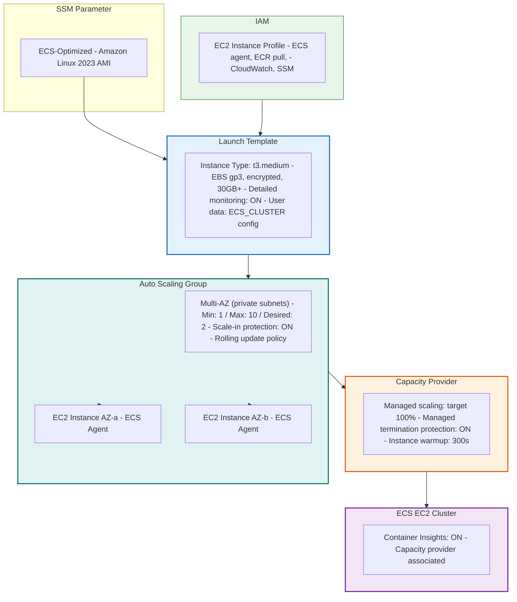

# EC2 — Compute Resources (EcsEc2ClusterStack)

```mermaid
flowchart TB
    subgraph SSM["SSM Parameter"]
        AMI["ECS-Optimized - Amazon Linux 2023 AMI"]
    end

    subgraph LT["Launch Template"]
        LTConfig["Instance Type: t3.medium - EBS gp3, encrypted, 30GB+ - Detailed monitoring: ON - User data: ECS_CLUSTER config"]
    end

    subgraph ASG["Auto Scaling Group"]
        ASGConfig["Multi-AZ (private subnets) - Min: 1 / Max: 10 / Desired: 2 - Scale-in protection: ON - Rolling update policy"]
        EC2a["EC2 Instance AZ-a - ECS Agent"]
        EC2b["EC2 Instance AZ-b - ECS Agent"]
    end

    subgraph CP["Capacity Provider"]
        CPConfig["Managed scaling: target 100% - Managed termination protection: ON - Instance warmup: 300s"]
    end

    subgraph Cluster["ECS EC2 Cluster"]
        ClusterConfig["Container Insights: ON - Capacity provider associated"]
    end

    subgraph IAM["IAM"]
        InstanceProfile["EC2 Instance Profile - ECS agent, ECR pull, - CloudWatch, SSM"]
    end

    AMI --> LT
    IAM --> LT
    LT --> ASG
    ASG --> EC2a
    ASG --> EC2b
    ASG --> CP
    CP --> Cluster

    style LT fill:#e3f2fd,stroke:#1565c0,stroke-width:2px
    style ASG fill:#e0f2f1,stroke:#00695c,stroke-width:2px
    style CP fill:#fff3e0,stroke:#e65100,stroke-width:2px
    style Cluster fill:#f3e5f5,stroke:#6a1b9a,stroke-width:2px
    style IAM fill:#e8f5e9,stroke:#2e7d32,stroke-width:1px
```
