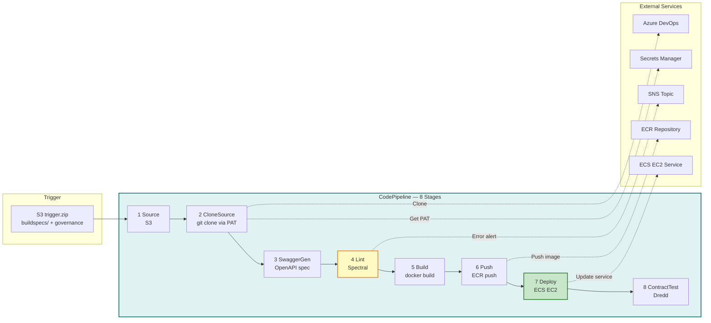

# EC2 — CI/CD Pipeline Flow (Per-Project — 8 Stages)

```mermaid
flowchart LR
    subgraph Trigger["Trigger"]
        S3T[S3 trigger.zip<br/>buildspecs/ + governance]
    end

    subgraph Pipeline["CodePipeline — 8 Stages"]
        S1["1 Source<br/>S3"]
        S2["2 CloneSource<br/>git clone via PAT"]
        S3["3 SwaggerGen<br/>OpenAPI spec"]
        S4["4 Lint<br/>Spectral"]
        S5["5 Build<br/>docker build"]
        S6["6 Push<br/>ECR push"]
        S7["7 Deploy<br/>ECS EC2"]
        S8["8 ContractTest<br/>Dredd"]
    end

    subgraph External["External Services"]
        ADO[Azure DevOps]
        ECR[ECR Repository]
        ECSvc[ECS EC2 Service]
        SM[Secrets Manager]
        SNST[SNS Topic]
    end

    S3T --> S1
    S1 --> S2 --> S3 --> S4 --> S5 --> S6 --> S7 --> S8

    S2 -.->|Get PAT| SM
    S2 -.->|Clone| ADO
    S4 -.->|Error alert| SNST
    S6 -.->|Push image| ECR
    S7 -.->|Update service| ECSvc

    style Pipeline fill:#e0f2f1,stroke:#00695c,stroke-width:2px
    style S7 fill:#c8e6c9,stroke:#2e7d32,stroke-width:2px
    style S4 fill:#fff9c4,stroke:#f57f17,stroke-width:2px
```
