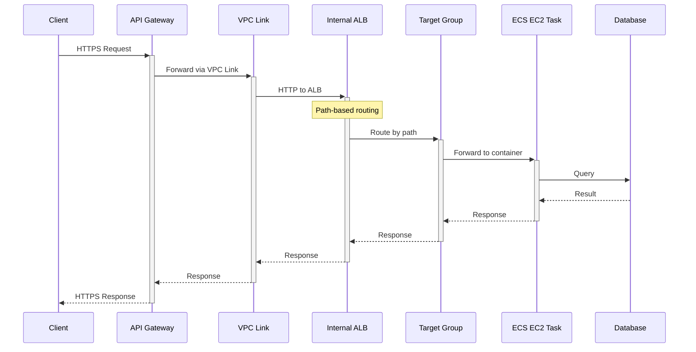

# EC2 — Request Flow

```mermaid
sequenceDiagram
    participant C as Client
    participant APIGW as API Gateway
    participant VL as VPC Link
    participant ALB as Internal ALB
    participant TG as Target Group
    participant ECS as ECS EC2 Task
    participant DB as Database

    C->>+APIGW: HTTPS Request
    APIGW->>+VL: Forward via VPC Link
    VL->>+ALB: HTTP to ALB
    Note over ALB: Path-based routing
    ALB->>+TG: Route by path
    TG->>+ECS: Forward to container
    ECS->>DB: Query
    DB-->>ECS: Result
    ECS-->>-TG: Response
    TG-->>-ALB: Response
    ALB-->>-VL: Response
    VL-->>-APIGW: Response
    APIGW-->>-C: HTTPS Response
```
