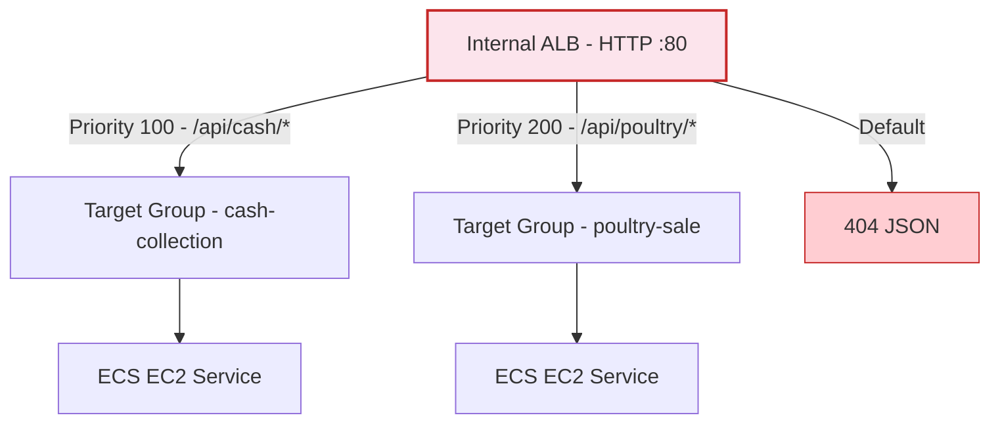

# EC2 — ALB Path-Based Routing

```mermaid
flowchart TB
    ALB[Internal ALB - HTTP :80]
    ALB -->|Priority 100 - /api/cash/*| TG1[Target Group - cash-collection]
    ALB -->|Priority 200 - /api/poultry/*| TG2[Target Group - poultry-sale]
    ALB -->|Default| D[404 JSON]
    TG1 --> SVC1[ECS EC2 Service]
    TG2 --> SVC2[ECS EC2 Service]

    style ALB fill:#fce4ec,stroke:#c62828,stroke-width:2px
    style D fill:#ffcdd2,stroke:#c62828,stroke-width:1px
```
