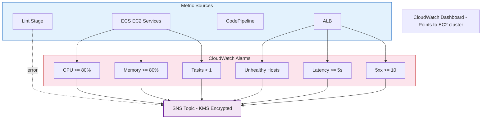

# EC2 — Monitoring & Observability

```mermaid
flowchart TB
    subgraph Sources["Metric Sources"]
        ECS_M["ECS EC2 Services"]
        ALB_M["ALB"]
        CP["CodePipeline"]
        LINT["Lint Stage"]
    end

    subgraph CWAlarms["CloudWatch Alarms"]
        A1["CPU >= 80%"]
        A2["Memory >= 80%"]
        A3["Tasks < 1"]
        A4["Unhealthy Hosts"]
        A5["Latency >= 5s"]
        A6["5xx >= 10"]
    end

    SNS["SNS Topic - KMS Encrypted"]
    Dashboard["CloudWatch Dashboard - Points to EC2 cluster"]

    ECS_M --> A1 & A2 & A3
    ALB_M --> A4 & A5 & A6
    LINT -.->|error| SNS
    A1 & A2 & A3 & A4 & A5 & A6 --> SNS

    style Sources fill:#e3f2fd,stroke:#1565c0
    style CWAlarms fill:#fce4ec,stroke:#c62828
    style SNS fill:#f3e5f5,stroke:#6a1b9a,stroke-width:2px
```
