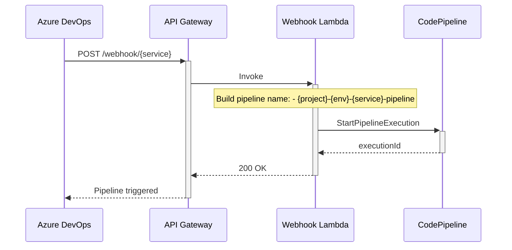

# EC2 — Webhook Integration (Azure DevOps → AWS)

```mermaid
sequenceDiagram
    participant ADO as Azure DevOps
    participant APIGW as API Gateway
    participant Lambda as Webhook Lambda
    participant CP as CodePipeline

    ADO->>+APIGW: POST /webhook/{service}
    APIGW->>+Lambda: Invoke
    Note over Lambda: Build pipeline name: - {project}-{env}-{service}-pipeline
    Lambda->>+CP: StartPipelineExecution
    CP-->>-Lambda: executionId
    Lambda-->>-APIGW: 200 OK
    APIGW-->>-ADO: Pipeline triggered
```
