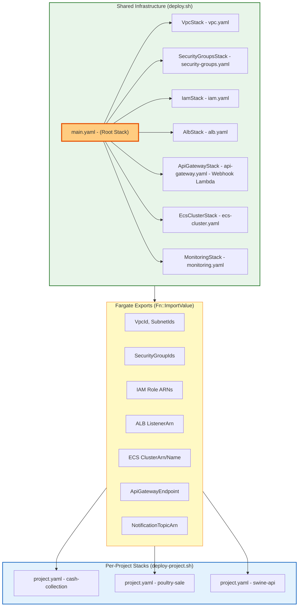

# Fargate — Deployment Model (Two-Tier Architecture)

```mermaid
flowchart TB
    subgraph SharedInfra["Shared Infrastructure (deploy.sh)"]
        Main["main.yaml - (Root Stack)"]
        Main --> VPC["VpcStack - vpc.yaml"]
        Main --> SG["SecurityGroupsStack - security-groups.yaml"]
        Main --> IAM["IamStack - iam.yaml"]
        Main --> ALB["AlbStack - alb.yaml"]
        Main --> APIGW["ApiGatewayStack - api-gateway.yaml - Webhook Lambda"]
        Main --> ECS["EcsClusterStack - ecs-cluster.yaml"]
        Main --> MON["MonitoringStack - monitoring.yaml"]
    end

    subgraph Exports["Fargate Exports (Fn::ImportValue)"]
        E1[VpcId, SubnetIds]
        E2[SecurityGroupIds]
        E3[IAM Role ARNs]
        E4[ALB ListenerArn]
        E5[ECS ClusterArn/Name]
        E6[ApiGatewayEndpoint]
        E7[NotificationTopicArn]
    end

    subgraph ProjectStacks["Per-Project Stacks (deploy-project.sh)"]
        P1["project.yaml - cash-collection"]
        P2["project.yaml - poultry-sale"]
        P3["project.yaml - swine-api"]
    end

    SharedInfra --> Exports
    Exports --> P1
    Exports --> P2
    Exports --> P3

    style SharedInfra fill:#e8f5e9,stroke:#2e7d32,stroke-width:2px
    style Exports fill:#fff9c4,stroke:#f57f17,stroke-width:1px
    style ProjectStacks fill:#e3f2fd,stroke:#1565c0,stroke-width:2px
    style Main fill:#ffcc80,stroke:#e65100,stroke-width:3px
```
