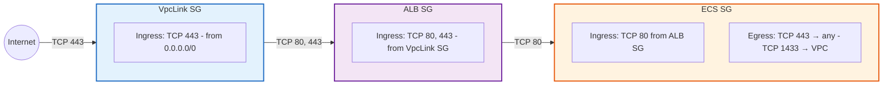

# Fargate — Security Groups Chain

```mermaid
flowchart LR
    Internet((Internet)) -->|TCP 443| VpcLinkSG
    subgraph VpcLinkSG["VpcLink SG"]
        VL_IN["Ingress: TCP 443 - from 0.0.0.0/0"]
    end
    VpcLinkSG -->|TCP 80, 443| AlbSG
    subgraph AlbSG["ALB SG"]
        ALB_IN["Ingress: TCP 80, 443 - from VpcLink SG"]
    end
    AlbSG -->|TCP 80| EcsSG
    subgraph EcsSG["ECS SG"]
        ECS_IN["Ingress: TCP 80 from ALB SG"]
        ECS_OUT["Egress: TCP 443 → any - TCP 1433 → VPC"]
    end

    style VpcLinkSG fill:#e3f2fd,stroke:#1565c0,stroke-width:2px
    style AlbSG fill:#f3e5f5,stroke:#6a1b9a,stroke-width:2px
    style EcsSG fill:#fff3e0,stroke:#e65100,stroke-width:2px
```
