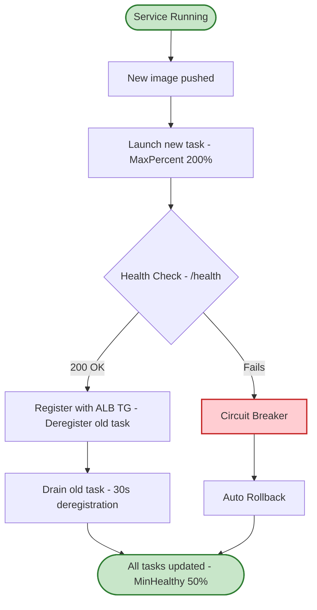

# Fargate — ECS Deployment Strategy

```mermaid
flowchart TD
    Start([Service Running]) --> Trigger[New image pushed]
    Trigger --> Launch[Launch new task - MaxPercent 200%]
    Launch --> HC{Health Check - /health}
    HC -->|200 OK| Register[Register with ALB TG - Deregister old task]
    HC -->|Fails| CB[Circuit Breaker]
    Register --> Drain[Drain old task - 30s deregistration]
    Drain --> Done([All tasks updated - MinHealthy 50%])
    CB --> Rollback[Auto Rollback]
    Rollback --> Done

    style Start fill:#c8e6c9,stroke:#2e7d32,stroke-width:2px
    style Done fill:#c8e6c9,stroke:#2e7d32,stroke-width:2px
    style CB fill:#ffcdd2,stroke:#c62828,stroke-width:2px
```
