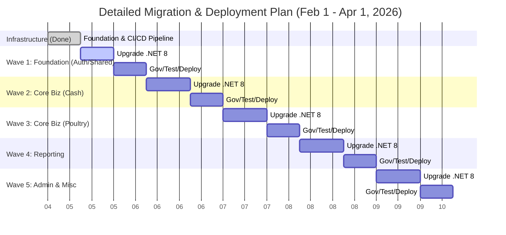

# Fargate — Migration & Deployment Timeline

```mermaid
gantt
    title Detailed Migration & Deployment Plan (Feb 1 - Apr 1, 2026)
    dateFormat  YYYY-MM-DD
    axisFormat  %W

    section Infrastructure (Done)
    Foundation & CI/CD Pipeline     :done,    i1, 2026-02-01, 3d

    section Wave 1: Foundation (Auth/Shared)
    Upgrade .NET 8                  :active,  w1_m, 2026-02-04, 3d
    Gov/Test/Deploy                 :         w1_d, after w1_m, 3d

    section Wave 2: Core Biz (Cash)
    Upgrade .NET 8                  :         w2_m, after w1_d, 4d
    Gov/Test/Deploy                 :         w2_d, after w2_m, 3d

    section Wave 3: Core Biz (Poultry)
    Upgrade .NET 8                  :         w3_m, after w2_d, 4d
    Gov/Test/Deploy                 :         w3_d, after w3_m, 3d

    section Wave 4: Reporting
    Upgrade .NET 8                  :         w4_m, after w3_d, 4d
    Gov/Test/Deploy                 :         w4_d, after w4_m, 3d

    section Wave 5: Admin & Misc
    Upgrade .NET 8                  :         w5_m, after w4_d, 4d
    Gov/Test/Deploy                 :         w5_d, after w5_m, 3d
```
