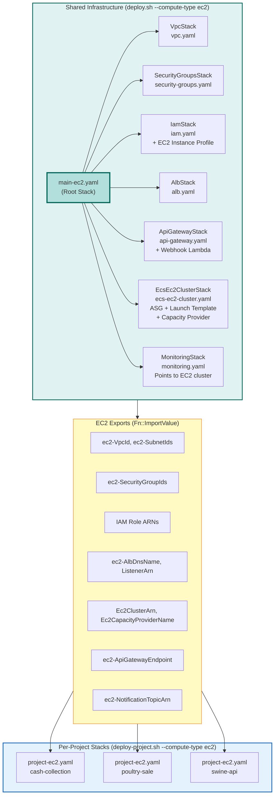
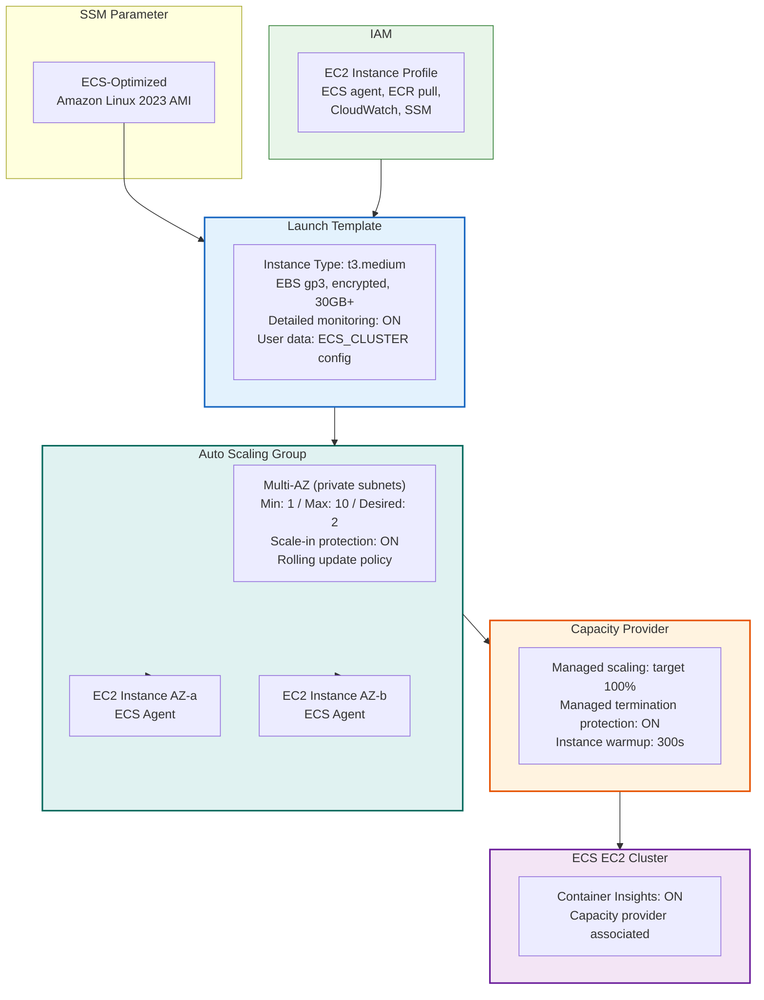
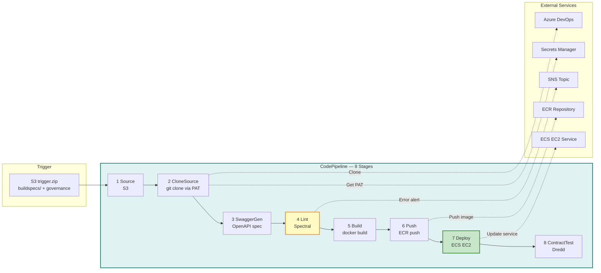
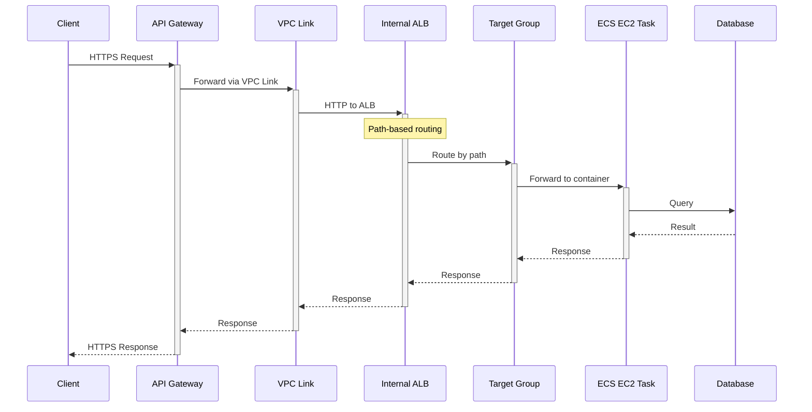
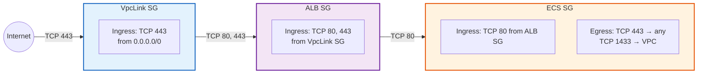
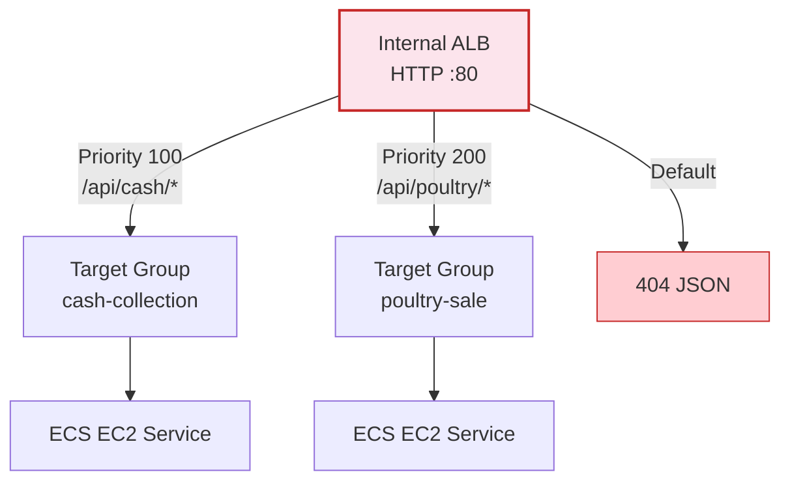
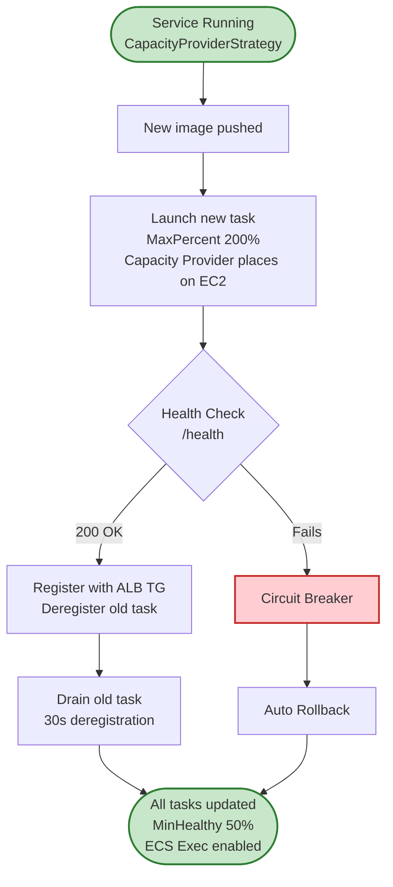
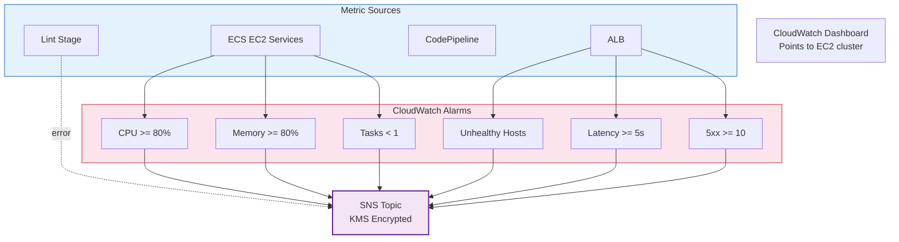
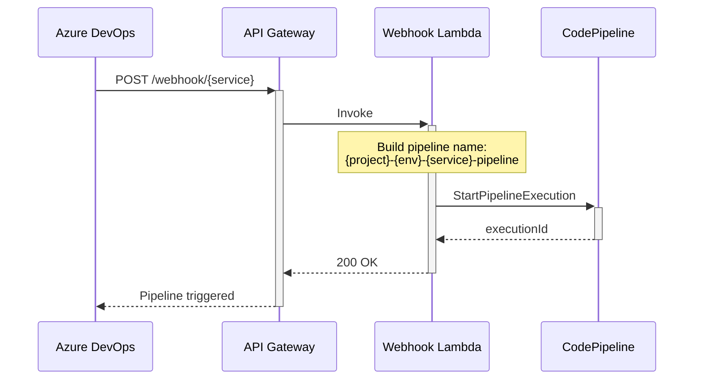

# Japfa API Platform — EC2 Infrastructure Architecture (Mermaid)

## 1. High-Level Infrastructure Overview

```mermaid
flowchart TB
    subgraph Internet
        Client[Client / Browser]
        AzureDevOps[Azure DevOps<br/>Git Repositories]
    end

    subgraph AWS["AWS Cloud (us-east-1)"]
        subgraph APIGW["API Gateway"]
            HttpApi[HTTP API Gateway<br/>HTTPS + TLS 1.2+<br/>Throttle: 500 rps / Burst: 1000]
            WebhookLambda[Webhook Lambda<br/>POST /webhook/service]
        end

        subgraph VPC["VPC 10.0.0.0/16"]
            VpcLink[VPC Link<br/>Private Subnets]

            subgraph AZa["AZ-a"]
                PubSub1[Public Subnet<br/>10.0.1.0/24]
                PrivSub1[Private Subnet<br/>10.0.10.0/24]
                NAT1[NAT Gateway 1<br/>+ Elastic IP]
            end

            subgraph AZb["AZ-b"]
                PubSub2[Public Subnet<br/>10.0.2.0/24]
                PrivSub2[Private Subnet<br/>10.0.11.0/24]
                NAT2[NAT Gateway 2<br/>+ Elastic IP]
            end

            IGW[Internet Gateway]

            subgraph ALBLayer["Load Balancing"]
                ALB[Internal ALB<br/>HTTP :80<br/>Default: 404 JSON]
            end

            subgraph EC2Layer["EC2 Instances (ASG)"]
                EC2_A[EC2 Instance AZ-a<br/>ECS Agent]
                EC2_B[EC2 Instance AZ-b<br/>ECS Agent]
            end

            subgraph ProjectA["Project: cash-collection"]
                TG_A[Target Group A<br/>/api/cash/*]
                SVC_A[ECS EC2 Service A]
                Pipeline_A[Pipeline A<br/>8 stages]
            end

            subgraph ProjectB["Project: poultry-sale"]
                TG_B[Target Group B<br/>/api/poultry/*]
                SVC_B[ECS EC2 Service B]
                Pipeline_B[Pipeline B<br/>8 stages]
            end
        end

        subgraph SharedInfra["Shared Resources"]
            ECSCluster[ECS EC2 Cluster<br/>Capacity Provider<br/>Managed Scaling]
            IAMRoles[IAM Roles<br/>Pipeline, CodeBuild,<br/>ECS Exec, ECS Task,<br/>EC2 Instance, Webhook Lambda]
        end

        subgraph PerProject["Per-Project Resources"]
            ECR_A[ECR: cash-collection]
            ECR_B[ECR: poultry-sale]
            PAT_A[Secrets: PAT A]
            PAT_B[Secrets: PAT B]
            S3_A[Artifacts: A]
            S3_B[Artifacts: B]
        end

        subgraph Monitoring["Monitoring"]
            SNS[SNS Topic<br/>KMS Encrypted]
            CWDash[CloudWatch Dashboard]
            Alarms[CloudWatch Alarms]
        end
    end

    Client -->|HTTPS| HttpApi
    HttpApi --> VpcLink
    HttpApi --> WebhookLambda
    WebhookLambda -.->|StartPipeline| Pipeline_A
    WebhookLambda -.->|StartPipeline| Pipeline_B
    VpcLink --> ALB
    ALB -->|/api/cash/*| TG_A
    ALB -->|/api/poultry/*| TG_B
    TG_A --> SVC_A
    TG_B --> SVC_B
    ECSCluster --> EC2_A
    ECSCluster --> EC2_B
    EC2_A --> SVC_A
    EC2_B --> SVC_B

    AzureDevOps -.->|PAT clone| Pipeline_A
    AzureDevOps -.->|PAT clone| Pipeline_B
    AzureDevOps -.->|Webhook POST| WebhookLambda

    Pipeline_A -->|Deploy| SVC_A
    Pipeline_B -->|Deploy| SVC_B
    Pipeline_A -->|Push| ECR_A
    Pipeline_B -->|Push| ECR_B

    IGW --- PubSub1
    IGW --- PubSub2
    NAT1 -.->|Outbound| PrivSub1
    NAT2 -.->|Outbound| PrivSub2

    Alarms --> SNS

    style AWS fill:#f5f5f5,stroke:#232f3e,stroke-width:2px
    style VPC fill:#e8f4e8,stroke:#1b660f,stroke-width:2px
    style ALBLayer fill:#fce4ec,stroke:#c62828,stroke-width:1px
    style EC2Layer fill:#e0f2f1,stroke:#00695c,stroke-width:2px
    style ProjectA fill:#e3f2fd,stroke:#1565c0,stroke-width:1px
    style ProjectB fill:#fff3e0,stroke:#e65100,stroke-width:1px
    style SharedInfra fill:#e8f5e9,stroke:#2e7d32,stroke-width:1px
    style Monitoring fill:#f3e5f5,stroke:#6a1b9a,stroke-width:1px
```

## 2. Deployment Model — Two-Tier Architecture

---

## 3. EC2 Compute Resources (EcsEc2ClusterStack)

---

## 4. CI/CD Pipeline Flow (Per-Project — 8 Stages)

---

## 5. Request Flow

---

## 6. Security Groups Chain

---

## 7. ALB Path-Based Routing

---

## 8. ECS Deployment Strategy (EC2 — Capacity Provider)

---

## 9. Monitoring & Observability

---

## 10. Webhook Integration (Azure DevOps → AWS)

