# Japfa API Platform — Infrastructure Architecture (Mermaid)

## 1. High-Level Infrastructure Overview

```mermaid
flowchart TB
    subgraph Internet
        Client[Client / Browser]
        AzureDevOps[Azure DevOps<br/>Git Repositories]
    end

    subgraph AWS["AWS Cloud (us-east-1)"]
        subgraph APIGW["API Gateway"]
            HttpApi[HTTP API Gateway<br/>HTTPS + TLS 1.2+<br/>Throttle: 500 rps / Burst: 1000]
            WebhookLambda[Webhook Lambda<br/>POST /webhook/service]
        end

        subgraph VPC["VPC 10.0.0.0/16"]
            VpcLink[VPC Link<br/>Private Subnets]

            subgraph AZa["AZ-a"]
                PubSub1[Public Subnet<br/>10.0.1.0/24]
                PrivSub1[Private Subnet<br/>10.0.10.0/24]
                NAT1[NAT Gateway 1<br/>+ Elastic IP]
            end

            subgraph AZb["AZ-b"]
                PubSub2[Public Subnet<br/>10.0.2.0/24]
                PrivSub2[Private Subnet<br/>10.0.11.0/24]
                NAT2[NAT Gateway 2<br/>+ Elastic IP]
            end

            IGW[Internet Gateway]

            subgraph ALBLayer["Load Balancing (Shared)"]
                ALB[Internal ALB<br/>HTTP :80<br/>Default: 404 JSON]
            end

            subgraph ProjectA["Project: cash-collection"]
                TG_A[Target Group A<br/>/api/cash/*]
                SVC_A[ECS Service A<br/>Fargate / EC2]
                Pipeline_A[Pipeline A<br/>8 stages]
            end

            subgraph ProjectB["Project: poultry-sale"]
                TG_B[Target Group B<br/>/api/poultry/*]
                SVC_B[ECS Service B<br/>Fargate / EC2]
                Pipeline_B[Pipeline B<br/>8 stages]
            end
        end

        subgraph SharedInfra["Shared Resources (per compute type)"]
            ECSCluster[ECS Cluster<br/>Fargate: FARGATE + FARGATE_SPOT<br/>EC2: separate cluster + Capacity Provider<br/>Both: 7 shared stacks + per-project stacks]
            IAMRoles[IAM Roles<br/>Pipeline, CodeBuild,<br/>ECS Exec, ECS Task,<br/>EC2 Instance, Webhook Lambda]
        end

        subgraph PerProject["Per-Project Resources"]
            ECR_A[ECR: cash-collection]
            ECR_B[ECR: poultry-sale]
            PAT_A[Secrets: PAT A]
            PAT_B[Secrets: PAT B]
            S3_A[Artifacts: A]
            S3_B[Artifacts: B]
        end

        subgraph Monitoring["Monitoring (Shared)"]
            SNS[SNS Topic<br/>KMS Encrypted]
            CWDash[CloudWatch Dashboard]
            Alarms[CloudWatch Alarms]
        end
    end


    Client -->|HTTPS| HttpApi
    HttpApi --> VpcLink
    HttpApi --> WebhookLambda
    WebhookLambda -.->|StartPipeline| Pipeline_A
    WebhookLambda -.->|StartPipeline| Pipeline_B
    VpcLink --> ALB
    ALB -->|/api/cash/*| TG_A
    ALB -->|/api/poultry/*| TG_B
    TG_A --> SVC_A
    TG_B --> SVC_B
    ECSCluster --> SVC_A
    ECSCluster --> SVC_B

    AzureDevOps -.->|PAT clone| Pipeline_A
    AzureDevOps -.->|PAT clone| Pipeline_B
    AzureDevOps -.->|Webhook POST| WebhookLambda

    Pipeline_A -->|Deploy| SVC_A
    Pipeline_B -->|Deploy| SVC_B
    Pipeline_A -->|Push| ECR_A
    Pipeline_B -->|Push| ECR_B

    IGW --- PubSub1
    IGW --- PubSub2
    NAT1 -.->|Outbound| PrivSub1
    NAT2 -.->|Outbound| PrivSub2

    Alarms --> SNS

    style AWS fill:#f5f5f5,stroke:#232f3e,stroke-width:2px
    style VPC fill:#e8f4e8,stroke:#1b660f,stroke-width:2px
    style ALBLayer fill:#fce4ec,stroke:#c62828,stroke-width:1px
    style ProjectA fill:#e3f2fd,stroke:#1565c0,stroke-width:1px
    style ProjectB fill:#fff3e0,stroke:#e65100,stroke-width:1px
    style SharedInfra fill:#e8f5e9,stroke:#2e7d32,stroke-width:1px
    style Monitoring fill:#f3e5f5,stroke:#6a1b9a,stroke-width:1px

```

## 2. Deployment Model — Two-Tier Architecture

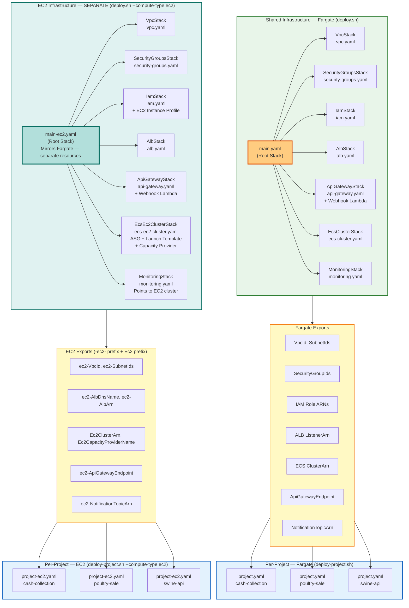

---

## 3. CI/CD Pipeline Flow (Per-Project — 8 Stages)

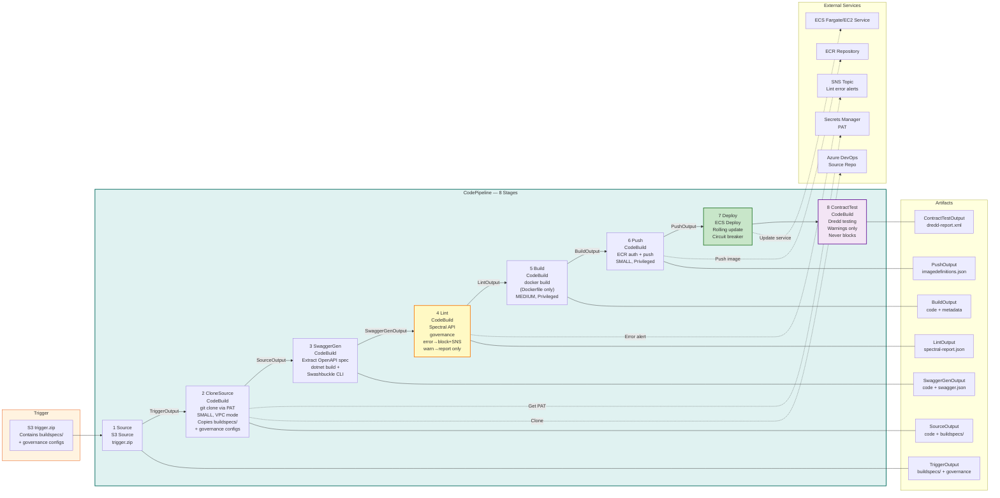

---

## 4. Buildspec Strategy — Generic (Dockerfile Only) + API Governance

```mermaid
flowchart TB
    subgraph InfraRepo["Infra Repo (buildspecs/)"]
        BS1["buildspec-source.yml<br/>Generic: clone + copy buildspecs<br/>+ governance configs"]
        BS2["buildspec-swagger-gen.yml<br/>Generic: extract OpenAPI spec<br/>from ASP.NET Swashbuckle"]
        BS3["buildspec-lint.yml<br/>Generic: Spectral API governance<br/>error→block, warn→report"]
        BS4["buildspec-build.yml<br/>Generic: docker build<br/>Convention: Dockerfile at root"]
        BS5["buildspec-push.yml<br/>Generic: ECR push<br/>All values from env vars"]
        BS6["buildspec-contract-test.yml<br/>Generic: Dredd contract testing<br/>All failures → warnings"]
    end

    subgraph GovernanceConfig["Governance Config (buildspecs/governance/)"]
        G1[".spectral.yml<br/>API linting ruleset<br/>naming, security, HTTP methods,<br/>response format, versioning"]
        G2["dredd.yml<br/>Dredd test configuration"]
        G3["dredd-hooks.js<br/>Convert failures to warnings<br/>Collect warnings report"]
    end

    subgraph TriggerZip["trigger.zip"]
        T1[buildspecs/buildspec-source.yml]
        T2[buildspecs/buildspec-swagger-gen.yml]
        T3[buildspecs/buildspec-lint.yml]
        T4[buildspecs/buildspec-build.yml]
        T5[buildspecs/buildspec-push.yml]
        T6[buildspecs/buildspec-contract-test.yml]
        T7[.spectral.yml]
        T8[dredd.yml + dredd-hooks.js]
        T9[trigger.json]
    end

    subgraph ProjectRepo["Project Source Repo<br/>(Azure DevOps)"]
        DF[Dockerfile<br/>Multi-stage build<br/>Handles compile/publish]
        Code[Application Code]
        OptSpec[swagger.json<br/>optional]
    end

    InfraRepo -->|bundled into| TriggerZip
    GovernanceConfig -->|bundled into| TriggerZip
    TriggerZip -->|Stage 1: Source| ST1[S3 Source]
    ST1 -->|Stage 2: Clone| ST2[CloneSource]
    ST2 -->|Clones| ProjectRepo
    ST2 -->|Stage 3| ST3[SwaggerGen<br/>Extract/use OpenAPI spec]
    ST3 -->|Stage 4| ST4[Lint<br/>Spectral governance]
    ST4 -->|Stage 5| ST5[Build<br/>docker build]
    ST5 -->|Stage 6| ST6[Push<br/>ECR push]
    ST6 -->|Stage 7| ST7[Deploy<br/>ECS rolling update]
    ST7 -->|Stage 8| ST8[ContractTest<br/>Dredd vs deployed API]

    style InfraRepo fill:#e8f5e9,stroke:#2e7d32,stroke-width:2px
    style GovernanceConfig fill:#fff9c4,stroke:#f57f17,stroke-width:2px
    style ProjectRepo fill:#e3f2fd,stroke:#1565c0,stroke-width:2px
    style TriggerZip fill:#fff3e0,stroke:#e65100,stroke-width:1px
```

---

## 5. Request Flow (Detailed)

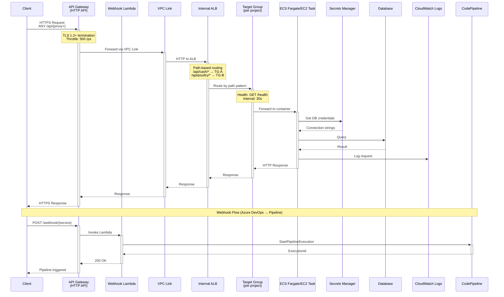

---

## 6. VPC Network Architecture

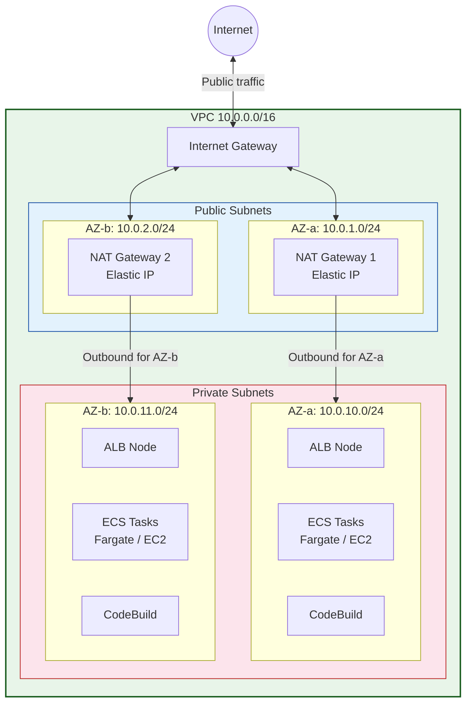

---

## 7. Security Groups Chain

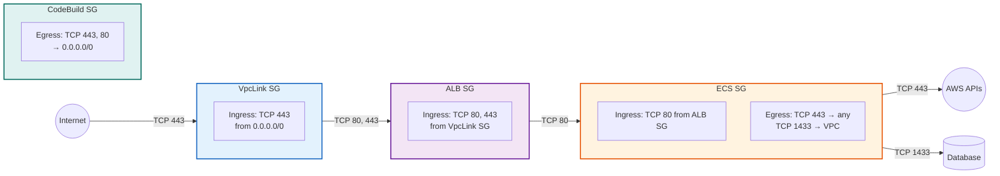

---

## 8. ALB Path-Based Routing (Multi-Project)

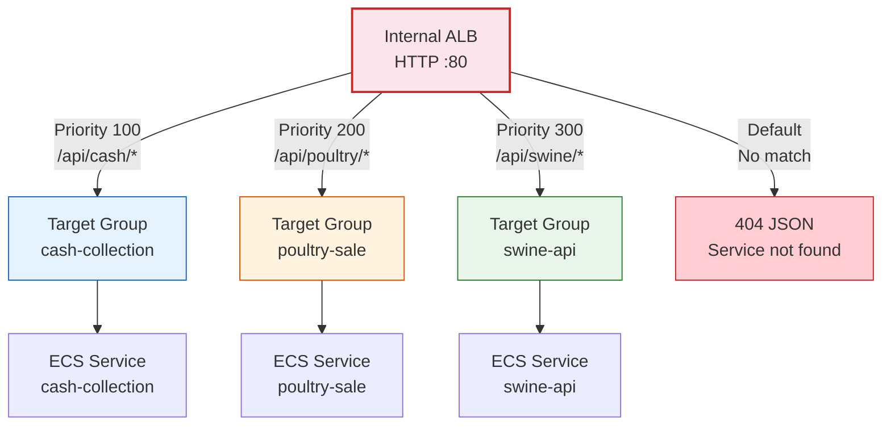

---

## 9. ECS Deployment Strategy

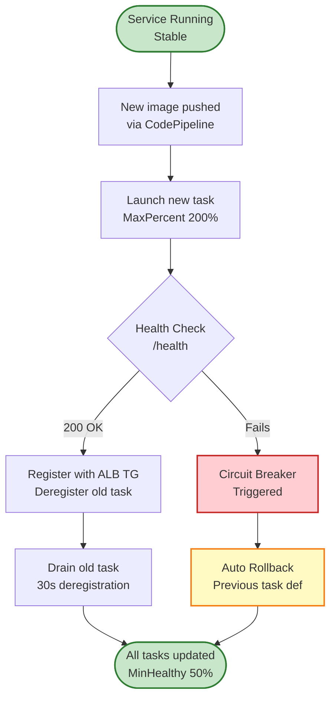

---

## 10. Monitoring & Observability

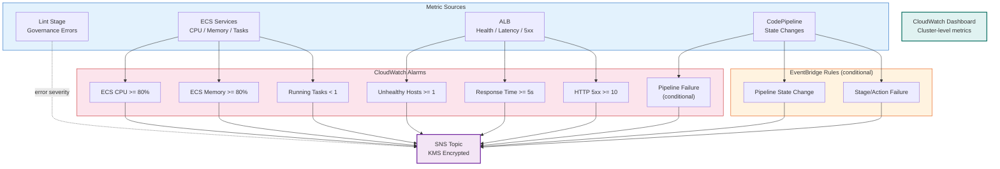

---

## 11. EC2 Compute Architecture

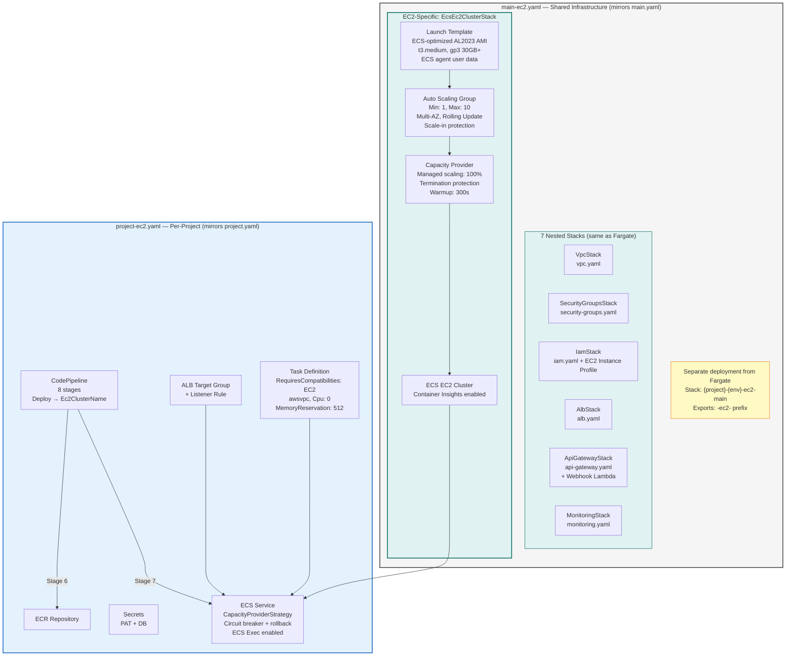

---

## 12. API Governance Flow

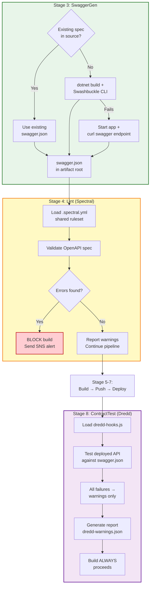

---

## 13. Webhook Integration (Azure DevOps → AWS)

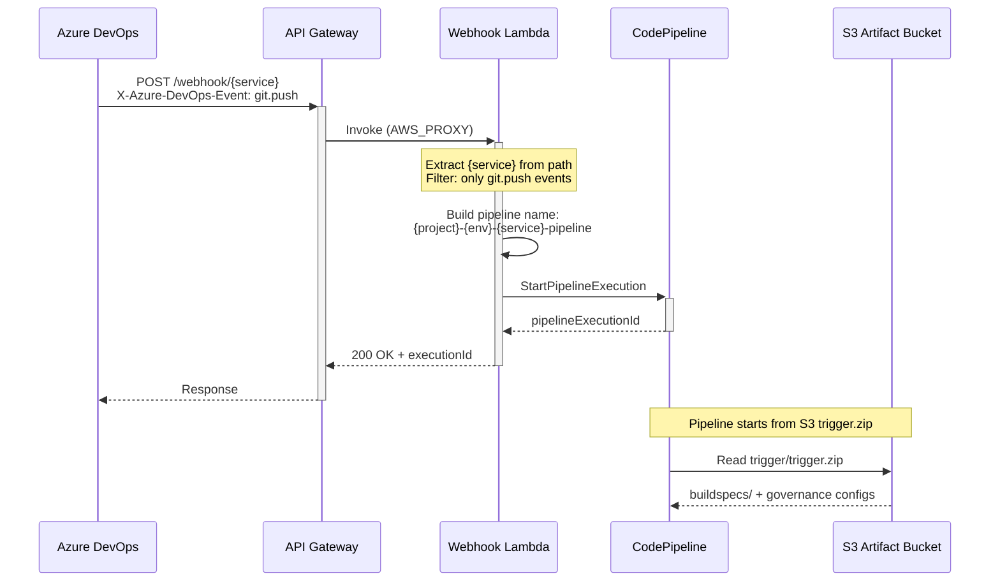
